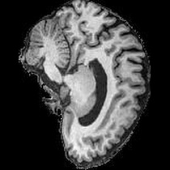
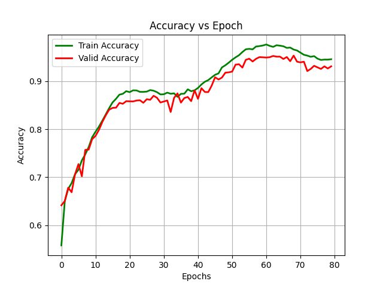
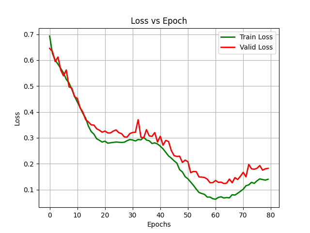
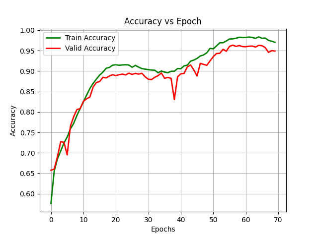
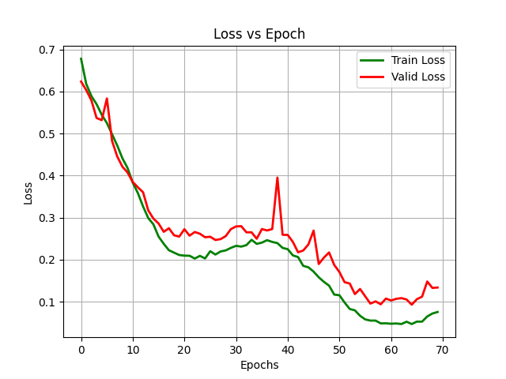
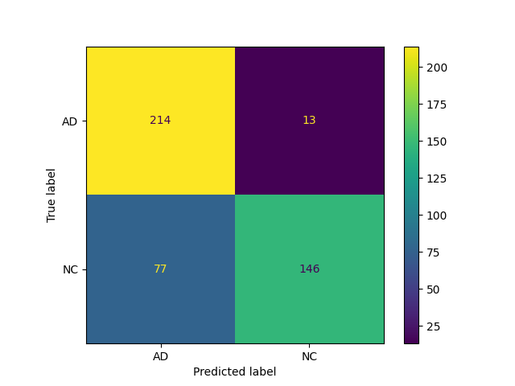
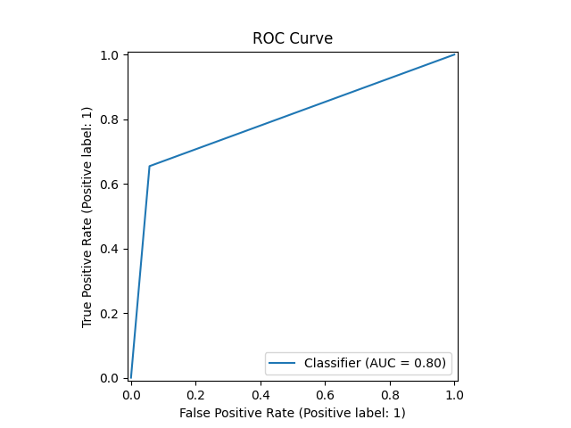
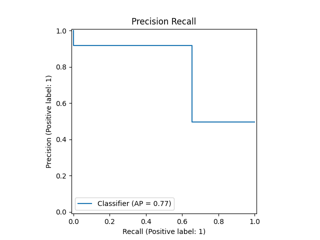

# COMP3710 Pattern Recognition and Analysis  
## Alzheimer’s Disease Classifier using ADNI Brain Data  
### Model Chosen: GFNet  
A GFNet model was designed and trained to classify Alzheimer’s in MRI brain scan images, with training and testing data provided by the [ADNI dataset](https://adni.loni.usc.edu/). 
The model was trained on the Google Colab A100 GPU, and managed to to have an 80.00% accuracy on the test set.  

### Introduction  
Alzheimer’s Disease is a type of dementia that affects memory, thinking and behaviour of the affected patient[^1]. 
It typically shrinks the brain, kills neurons and a buildup of plaque can accumulate in areas such as the hippocampus[^2].  
[^2] 
**Normal Brain vs Advanced Alzheimer's Visual**  

The ADNI dataset consists of 21525 images in the training set (10401 AD, 11124 NC) and 9000 images in the testing dataset (4460 AD, 4546 NC). 
6 images wihin the NC testing dataset were deleted as they were duplicates and cause issues with the testing data. These images could've been an error 
from when data was being transferred locally.  

|  |  |
| ----- | ----- |
| **Neurotypical Brain Image from NC training data** | **Alzheimer Affected Brain Image from AD training data** | 

As you can see from the images, it can be difficult and tedious to determine which brain has been affected by the disease. In situation like these, 
it can be helpful to use an image classifier to speed up the identification process.  

We have implemented a GFNet to tackle this image classifcation problem. 
GFNet stands for Global Filter Networks, and it is similar to a vision transform with some key differences. 
It makes use of a 2D Fourier Transformation to find frequency-domain features and runs an element-wise multiplication between said features and learnable global filters. 
The multiplied result is then converted back to the time domain using a 2D Inverse Fourier Transform[^3]. 
This mechanism is used to replace the self-attention layer found in vision tranformers, and is called the Global Filter Layer. 

[^4] 
**GFNet Visualised**  

This resolves the complexity that the self-attention brings to the model for larger images, and thus allows scaling for for higher level resolutions. 

#### GFNet Layers  
**Patch Embedding**: Converts the image to flattened image patches to feed into the network  
**Global Filter Layer**: 2D FFT -> learnable global filters * frequency features -> 2D Inverse FFT  
**Feed Forward Network**: Consists of a Multi-Layer Perceptron (MLP) which adds non-linearity and channel interaction  
**Global Average Pooling**: Calculates average value of each feature map

### Reproducing Results  
Within the train.py file, we set a seed to all of the random elements within the code. 
This ensures that we can reproduce the same result/model when re-running the code or when running 
on a different machine. 
  
```
def set_seed(seed: int):
    """
    Sets the seed of the random elements of the code in order to maintain consistency between trainings
    """
    torch.manual_seed(seed)                     # sets the seed for RNG on device
    torch.cuda.manual_seed(seed)                # sets the seed for current GPU
    torch.cuda.manual_seed_all(seed)            # sets the seed for all GPUs
    np.random.seed(seed)                        # sets the seed for Numpy library
    random.seed(seed)                           # sets the seed for Random library
    torch.backends.cudnn.deterministic = True   # sets cuDNN to only use deterministic convolution
    torch.backends.cudnn.benchmark = False      # sets cuDNN to not perform benchmarking
```

### Pre-processing Data  
#### Cropping and Resizing Data  
Throughout the dataset, we could see slight variations in the positioning of the 
brain (see above) between images, as well as the brain sizing. Additionally, 
the brain scan images typically included a lot of unneccessary background pixels. 
In order to remove the unneccesary pixels and to keep a consistent brain size, 
we crop and resize the dataset so that it maximises the brain region. This was done 
by extracting the rectangular region containing the non-background pixels and adding 
padding to the borders to fit a 210x210 image. These dimensions were chosen as there 
was no cropping dimension that exceeded 210 within the dataset. 

#### Transforms  
Transforms are used to provide variability in the training data through data augumentation. 
It increases the diversity of the dataset by slightly modifying the original images, and as 
a result can reduce the effects of overfitting when training the data. 

Transforms applied to dataset:  
**RandomResizedCrop**: Crops a random portion of image and resizes it to a given size[^8]  
**RandomRotation**: Rotates the image by a given angle[^8]  
**RandomAffine**: Random affine transformation of the image keeping center invariant[^8]  
**ElasticTransform**: Transform a tensor image with elastic transformations[^8]  
**RandomErasing**: Randomly selects a rectangle region in a torch.Tensor image and erases its pixels[^8]  

#### Normalisation
Both testing and training data need to be normalised in order to scale the images 
to a common range. 

In order to find appropriate mean and standard deviation values for the dataset, 
we iterated through all of the images in the training data and calculated the average 
mean and standard deviation of the training dataset. These were found to be 
``MEAN = 0.11486841564676334`` and ``STD = 0.21826585544938487`` respectively, and 
were used to normalise the data. 

|  |  |
| ----- | ----- |
| **Unprocessed Image** | **Pre-processed Image** | 

### Datasets  
#### ADNIDatasetTest Image Stacking
There are some small difference between the designed training dataset and the testing 
dataset. Namely, the testing dataset retrieves the data by patient rather than by image. 
This allows us to test on a stack of images common to a single patient rather than 
try to predict based off a single image alone. 

#### Loss function, Optimizer and Scheduler  

The *loss function* is used to calculate the difference between the predicted values and the 
true values of the data set. We have opted to use Binary Cross Entropy Loss for the loss function, 
since the task is a binary classification.  

The *optimizer* is used to change the parameters of the model to minimise the loss. We chose the 
AdamW for the optimizer due to its flexible nature and it's ability to remain stable and reduce overfitting, 
especially in large models like transformers.  

The *learning rate scheduler* is used to adjust the learning rate of the optimizer when training. 
It helps prevent overfitting of the data and improves overall convergence. We decided to use a 
CosineAnnealingLR for the scheduler due to it's reputation of being an effective scheduler for a 
wide range of models.  

### Results  
(See the jupyter notebook provided for the training and validation splits for the default seed 10)  

We first set MAX_EPOCHS to 100 to find where the model started overfitting

|  |  |
| ----- | ----- | 
| **Finding Ideal Epoch - Accuracy** | **Finding Ideal Epoch - Loss** |

As seen from the figures above, the model was relatively successful on the training and validation dataset. 
We can also see that the performance of the model peaks at around 60 epochs and then proceeds to 
start overfitting. Following this, we adjusted the number of MAX_EPOCHS to 75 to limit redundant training loops. 

When evaluating a model, precision refers to the classifiers ability not give false positives, 
while recall refers to the ability of the classifier to identify the true positive within the data[^5]. 
The F1 score also relates to these two statistic, with it being known as the harmonic mean of the 
precision and recall[^7]. Another method of evaluating a model is the ROC curve, which plots the true positive 
rate against the false positive rate [^6].  

When running predict.py we get the following statistics:  
```
              precision    recall  f1-score   support

          AD       0.74      0.94      0.83       227
          NC       0.92      0.65      0.76       223

    accuracy                           0.80       450
   macro avg       0.83      0.80      0.80       450
weighted avg       0.83      0.80      0.80       450

Testing accuracy:  0.8
ROC AUC:  0.7987198988562059
Precision:  0.9182389937106918
Recall:  0.6547085201793722
F1 score:  0.7643979057591623
```  
As well as the following figures:  

|  |  |
| ----- | ----- |
| **Final Model - Accuracy** | **Final Model - Loss**  

  
**Confusion Matrix** 

|  |  |
| ----- | ----- |
| **ROC Curve** | **Precision Recall Curve** |

The Confusion Matrix is a good indicator and visualiser for how successful our model is. 
From the figure, we can see that the confusion matrix that our model is relatively successful 
at detecting the true positive cases (top left). We can also see that the model has a rather high 
false positive rate (bottom left) however it has a low false negative rate (top right).  

These observations are also reflected in the ROC curve where we can see that the curve is skewed to 
the left axis representing the true positives while a fair distance away from the top axis suggesting 
that the model made significant number of false positive predictions, which matches the observation above.  

### Usage
For training the model using train.py:  
```
usage: train.py [-h] [-dp TRAINPATH] [-sp SAVEPATH] [-s SEED]

options:
  -h, --help            show this help message and exit
  -dp TRAINPATH, --trainpath TRAINPATH
                        Filepath to ADNI training dataset
  -sp SAVEPATH, --savepath SAVEPATH
                        Filepath to saved elements
  -s SEED, --seed SEED  Seed for reproducibility
```  

For predicting on the test dataset using predict.py:  
```
usage: predict.py [-h] [-dp TESTPATH] [-sp SAVEPATH] [-mp MODELPATH]

options:
  -h, --help            show this help message and exit
  -dp TESTPATH, --testpath TESTPATH
                        Filepath to ADNI testing dataset
  -sp SAVEPATH, --savepath SAVEPATH
                        Filepath to saved elements
  -mp MODELPATH, --modelpath MODELPATH
                        Filepath to saved model
```  

### Conclusion 
The designed GFNet model was relatively successful with an 80% accuracy on the testing data. 
The model did show some higher false positive rates, however this is preferred to a high false 
negative rate, especially in a medical sense since it would be more desireable to misdiagnose 
positively and get a second opinion rather than negatively and miss the case. 

Some possible improvements that could be applied are adjusting the mean and standard deviation 
values of the normalisation. Another possible improvement could be to experiment with some more 
data transforms such as jittering. 

### Dependencies  
- Python: 3.12.12
- Pytorch: 2.8.0  
- TorchVision: 0.23.0
- Numpy: 2.0.2  
- Scikit-learn: 1.6.1 
- Timm: 1.0.20 
- Tqdm: 4.67.1 
- Matplotlib: 3.10.0 
- PIL: 11.3.0
- cv2: 4.12.0

### References  
[^1]: https://www.alz.org/alzheimers-dementia/what-is-alzheimers  
[^2]: https://www.medicalnewstoday.com/articles/alzheimers-brain-vs-normal-brain#alzheimers-brain  
[^3]: https://arxiv.org/abs/2107.00645  
[^4]: https://github.com/raoyongming/GFNet
[^5]: https://scikit-learn.org/stable/modules/model_evaluation.html#precision-recall-f-measure-metrics
[^6]: https://scikit-learn.org/stable/modules/model_evaluation.html#roc-metrics
[^7]: https://scikit-learn.org/stable/modules/generated/sklearn.metrics.f1_score.html#sklearn.metrics.f1_score
[^8]: https://docs.pytorch.org/vision/main/transforms.html